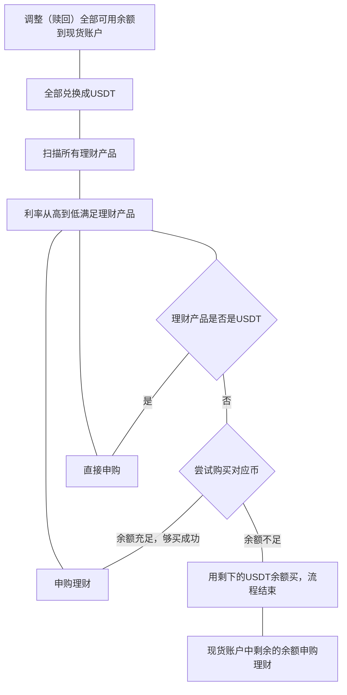

# binance-earn-helper

币安理财助手，自动调整到利率最高的稳定币理财上

不处理定期了，只处理活期，因为定期可能会影响资金灵活性，所以请手动操作

~~并不是币安的 API 设计的不好，定期活期的类型混在一起太麻烦才不写的~~

BTCUSDT

`BUY` side, 用 `quoteOrderQty` USDT 买入，或者买入 `quantity` 个 BTC
`SELL` side, 卖出得到 `quoteOrderQty` USDT，或者卖出 `quantity` 个 BTC

## TODO
### 固定执行位置
ConnectorClientError: Service unavailable from a restricted location according to 'b. Eligibility' in https://www.binance.com/en/terms. Please contact customer service if you believe you received this message in error.
    at httpRequestFunction (index-cf.js:14785:21)
    at async Promise.all (index 2)
    at async getEarnWalletBalance (index-cf.js:23944:21)
    at async prepareBalance (index-cf.js:23775:29)
    at async handler (index-cf.js:23742:5)
    at async Object.scheduled (index-cf.js:24103:5)