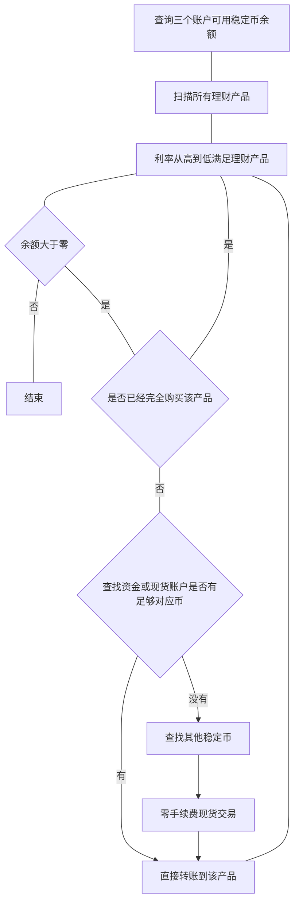

# binance-earn-helper
币安理财助手，自动调整到利率最高的稳定币理财上

不处理定期了，只处理活期，因为定期可能会影响资金灵活性，所以请手动操作

~~并不是币安的 API 设计的不好，定期活期的类型混在一起太麻烦才不写的~~

```mermaid
graph TD
    A["利率从高到低满足理财产品"]
    B{查找资金或现货账户是否有足够对应币}
    D["查找其他稳定币"]
    E["零手续费现货交易"]
    C["直接转账到该产品"]
    n1["查询三个账户可用稳定币余额"]
    n2{余额大于零}
    n3["结束"]
    n4{是否已经完全购买该产品}
    n5["扫描所有理财产品"]

    B -->|有| C
    B -->|没有| D --> E --> C
    A --- n2
    n2 ---|"否"| n3
    n2 ---|"是"| n4
    n4 ---|"是"| A
    n4 ---|"否"| B
    C --- A
	n1 --- n5
	n5 --- A
```
