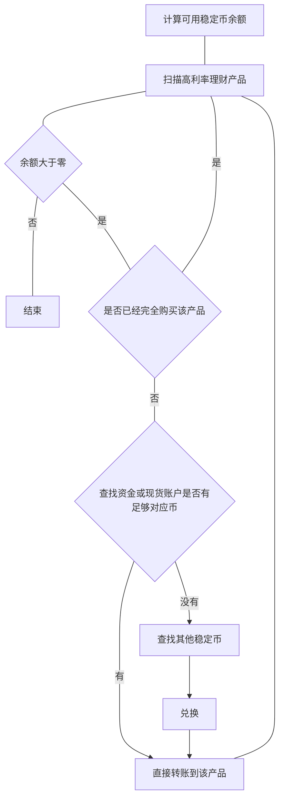

# binance-earn-helper
币安理财助手，自动调整到利率最高的稳定币理财上

```mermaid
graph TD
    A["扫描高利率理财产品"]
    B{查找资金或现货账户余额}
    D["查找其他稳定币"]
    E["兑换"]
    C["直接转账到该产品"]
    n1["计算可用稳定币余额"]
    n2@{ shape: "diam", label: "余额大于零" }
    n3["结束"]
    n4@{ shape: "diam", label: "是否已经完全购买该产品" }

    %% 资金或现货账户查询
    B -->|有| C
    B -->|没有| D --> E --> C
  
    %% 主流程
    n1 --- A
    A --- n2
    n2 ---|"否"| n3
    n2 ---|"是"| n4
    n4 ---|"是"| A
    n4 ---|"否"| B{"查找资金或现货账户是否有足够对应币"}
    C --- A
```
